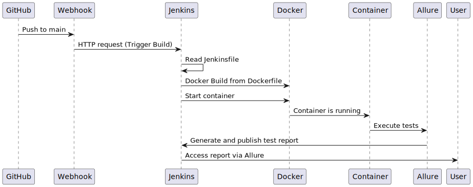
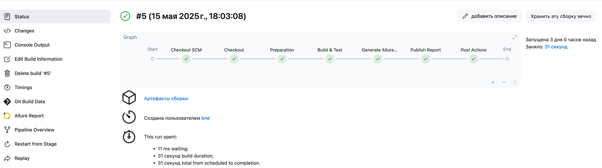
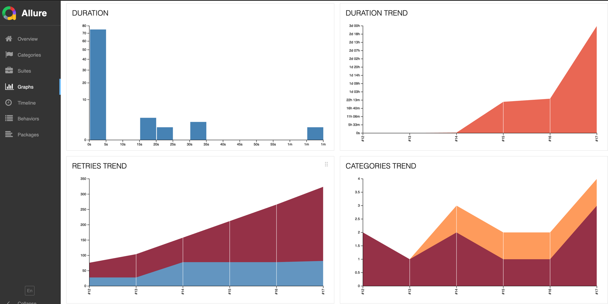
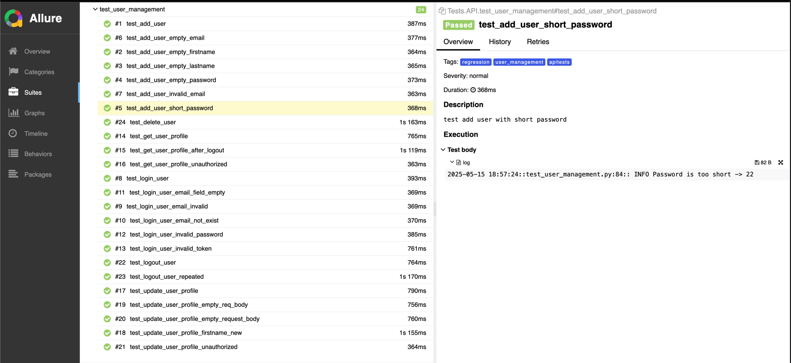

# TeamOne
Final project on testing web-app made by students of Md-PT2-20-25.

## Contributors:
<div>

-   <a href="https://github.com/whvt">
    
    </a>

-   <a href="https://github.com/club11">
    
    </a>

-   <a style="width: 50px; height: 50px;border-radius: 50%" href="https://github.com/KononovichM">
    
    </a>

<a  href="https://github.com/Stml89">
Special thanks to 

</a>
</div>

## Links
- Contacts app:
    https://thinking-tester-contact-list.herokuapp.com/

- Postman docs:
    https://documenter.getpostman.com/view/4012288/TzK2bEa8

## [Contents](#title1)
   - [Repo structure](#title2)
   - [Environment](#title3)
   - [Linters and autotests](#title4)
   - [How to run locally](#title5)
   - [CI/CD overview](#title6)
   - [Screenshots](#title7)


# <a id="title2"> Repo structure</a>

```commandline
.
├── Jenkinsfile
├── Misc
│   ├── Contacs.postman_collection.json
│   ├── diagram_uml.svg
│   ├── linters.bat
│   └── linters.sh
├── README.md
├── Tests
│   ├── API
│   │   ├── __init__.py
│   │   ├── conftest.py
│   │   ├── contacts_requests.py
│   │   ├── test_contact_management.py
│   │   ├── test_logs.log
│   │   ├── test_user_management.py
│   │   └── users_requests.py
│   ├── UI
│   │   ├── __init__.py
│   │   ├── conftest.py
│   │   ├── pages
│   │   │   ├── __init__.py
│   │   │   ├── add_contact_page.py
│   │   │   ├── base_page.py
│   │   │   ├── contact_details.py
│   │   │   ├── contact_edit_page.py
│   │   │   ├── contact_list_page.py
│   │   │   └── login_page.py
│   │   ├── test_add_contact.py
│   │   ├── test_contact_details.py
│   │   ├── test_contact_list.py
│   │   └── test_login.py
│   ├── __init__.py
│   ├── config
│   │   ├── __init__.py
│   │   ├── config_log.py
│   │   ├── env.py
│   │   └── user_creds.py
│   ├── conftest.py
│   └── utils
│       ├── __init__.py
│       ├── browser_manager.py
│       └── generator.py
├── dockerfile
├── img.png
├── linters.sh
├── pytest.ini
├── reports
│   ├── XXXXX-XXX-XXX-XXXX-results.json
└── requirements.txt
```
# <a id="title3"> Environment</a>
## Pytest Markers:
```commandline
  apitests: Run ALL API tests
  uitests: Run ALL UI tests
  integration: Run ALL integration tests
  api_integration: Run ALL API integration tests
  user_management: Tests related to user management
  contact_management: Tests related to contact management
  auth: Tests related to authentication
  regression: Run the regression test suite
  demo: Run few demo tests
```
Local linters may have sensitive project path. For convenience commands below
may be used, so changes to .bat and .sh won't be tracked:
```
git update-index --assume-unchanged Misc/linters.bat
git update-index --assume-unchanged Misc/linters.sh
```
# <a id="title5"> How to run locally</a>

```commandline
git clone <repoURL>

1: Using docker
docker build -t teamone .
docker run --rm teamone

2: Using local interpreter:
pip install requirements.txt
pytest + <pytest marker>
```

# <a id="title6"> CI/CD overview</a>


# <a id="title7"> Screenshots</a>


